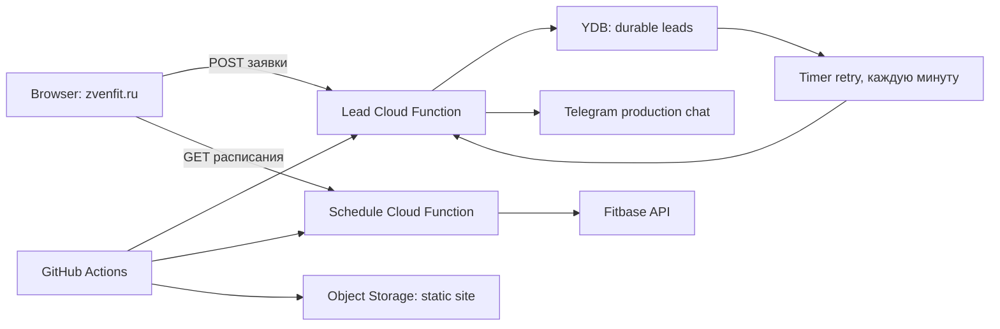
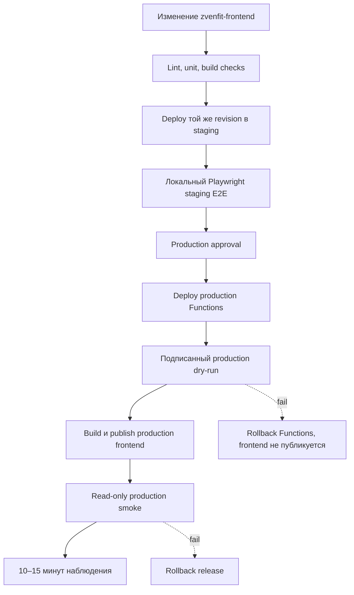
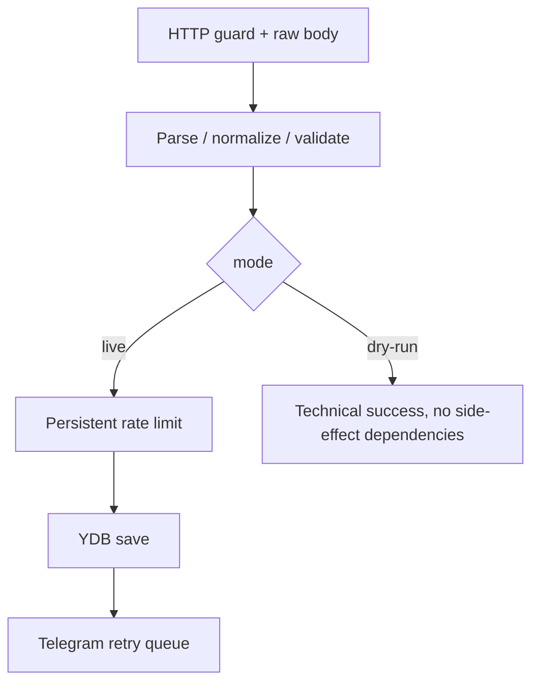

# Целевая архитектура ZvenFit и план реализации

Статус: **пересмотрено после аудита `zvenfit-frontend`**

Дата: 2026-08-13

Репозитории: `zvenfit-frontend` и локальный `zvenfit-autotests`

## Статус реализации на 2026-08-14

Завершён первый кодовый milestone, cloud-ресурсы не создавались:

- локальный Playwright baseline: 167 passed, 45 ожидаемо skipped;
- suite использует выделенный `127.0.0.1:43987` и не подключается к случайному
  процессу на dev-порту `4173`;
- в `zvenfit-frontend` подготовлена ветка
  `refactor/environment-aware-deploy` от актуального `origin/main`;
- production workflow превращён в wrapper над общей реализацией без изменения
  production resource names;
- добавлен ручной staging wrapper с отдельными names/origin;
- deployment config валидируется до cloud authentication;
- добавлены тесты на staging/production isolation и сохранение порядка
  integration test → YDB migration → Function version;
- frontend lint, function tests, deployment tests, monitoring tests и
  production-like static build проходят локально.

Следующий milestone — динамический fixture provider расписания. После него можно
выполнять административный bootstrap staging, не передавая staging-функции
production Fitbase token.

## 1. Итоговое решение

Полноценное staging-окружение нужно. Но его первый вариант следует строить как
второе изолированное окружение **уже работающей архитектуры**, а не начинать с
одновременного внедрения Terraform, API Gateway, Lockbox и новой модели релизов.

Базовое решение:

1. Сохраняем текущую связку: static frontend в Object Storage, прямые URL двух
   Yandex Cloud Functions, YDB и timer trigger.
2. Добавляем отдельный Yandex Cloud folder для staging со своими Functions,
   YDB, trigger, bucket, service accounts, секретами и Telegram test chat.
3. Обобщаем существующие deploy-скрипты и GitHub Actions под два окружения.
4. Staging проходит настоящий E2E заявки с синтетическими данными.
5. Production получает подписанный dry-run в текущем lead endpoint; dry-run
   валидирует production-конфигурацию, но не пишет заявку и не вызывает Telegram.
6. `zvenfit-autotests` остаётся локальным. Его файлы, данные и browser artifacts
   не загружаются в GitHub Actions и внешние хранилища.
7. Terraform, API Gateway, Lockbox и OIDC рассматриваются отдельно. Это полезные
   улучшения, но ни одно из них не является prerequisite для staging.

## 2. Что фактически реализовано сейчас

Решение основано на аудите кода и документации соседнего репозитория, а не на
предположениях. Проверены:

- `.github/workflows/main.yml`;
- `scripts/build-static.cjs`;
- `scripts/deploy-lead-intake.sh`;
- `scripts/deploy-fitbase-schedule.sh`;
- `functions/lead-intake/src/ydb/migrations.ts` и YDB integration tests;
- `scripts/smoke-production.cjs`;
- `docs/setup.md`, `docs/launch-checklist.md`, актуальный `docs/monitoring.md`.

Текущая production-схема:



### Важные свойства текущего решения

- `public/` — исходник статического сайта, `dist/` — генерируемый результат.
- Сборка подставляет `LEAD_API_URL` и `SCHEDULE_API_URL` прямо в
  `dist/js/lead-config.js` и `dist/js/schedule-config.js`.
- Поэтому frontend artifact сейчас **зависит от окружения**. Требование
  build-once/promote-many невозможно добавить без изменения runtime config или
  перехода на стабильные относительные API URL.
- Lead request сначала надёжно сохраняется в YDB, затем Telegram доставляется
  асинхронно с retry. Telegram не является источником истины.
- YDB использует версионированные миграции. Перед production migration deploy
  запускает integration tests на случайных временных таблицах.
- Обычный CI deploy имеет урезанные права. YDB, functions, public invoker binding
  и runtime service account создаются один раз администратором.
- Deploy проверяет наличие одноразового public binding, но не выдаёт его сам.
- Production smoke выполняет только `GET` и `OPTIONS`; `POST` заявки запрещён.
- Monitoring уже содержит structured logs, PII redaction, application metrics,
  dashboard и alerts.
- Log metrics, notification channels и alerts сейчас не представлены как
  ресурсы публичного `yc` CLI или Terraform provider. Их desired state хранится
  в `scripts/monitoring.config.json`, а создаются они в management console.

Эти свойства сохраняются. Новый контур не должен откатывать уже принятые
решения по durable storage, миграциям, IAM и безопасному smoke.

## 3. Почему не начинаем с Terraform

Предыдущая версия плана преждевременно делала Terraform обязательной основой.
После аудита это решение отменено.

Terraform сейчас даст не только пользу, но и дополнительную систему владения:

- потребуется отдельное защищённое remote state storage и locking;
- bootstrap identity обычно получит более широкие права, чем текущий CI;
- уже проверенные deploy-инварианты функций, миграций и trigger придётся либо
  дублировать, либо разделять между Terraform и shell;
- monitoring всё равно останется частично ручным из-за отсутствующих provider
  resources;
- смешанное владение одной Function/YDB/trigger из Terraform и `yc` создаст
  риск drift и непредсказуемых изменений.

Для двух стабильных окружений текущая модель проще и безопаснее:

```text
one-time admin bootstrap + tested yc deploy scripts + versioned YDB migrations
```

### Когда Terraform станет оправдан

Вернуться к решению стоит, если выполняется хотя бы несколько условий:

- появилось третье окружение или несколько независимых сайтов/проектов;
- инфраструктура регулярно меняется, а не создаётся один раз;
- drift между staging и production становится проблемой;
- есть защищённый backend для state и понятная модель доступа к нему;
- нужные ресурсы поддерживаются provider без ручных console-only шагов;
- команда готова передать Terraform эксклюзивное владение выбранными ресурсами.

Даже тогда Terraform должен владеть долгоживущими ресурсами, а application
release и YDB migrations могут остаться в текущих deploy-скриптах. Нельзя
одновременно менять один ресурс Terraform и `yc`-скриптом без явно разделённой
ответственности.

## 4. Целевая схема первого полноценного staging



Staging и production собираются из одного commit SHA, но пока получают разные
frontend builds из-за подстановки API URL. Это честное ограничение текущей
системы. На первом этапе важнее одинаковая revision исходников и проверяемый
manifest, чем искусственное требование одного frontend archive.

## 5. Изоляция окружений

Рекомендуемая граница — отдельный Yandex Cloud folder `zvenfit-staging`.

| Компонент | Staging | Production |
| --- | --- | --- |
| Frontend | `staging.zvenfit.ru` | `zvenfit.ru` и текущие домены |
| Object Storage | отдельный staging bucket | текущий `zvenfit-frontend` |
| Lead Function | `zvenfit-telegram-lead-staging` | `zvenfit-telegram-lead` |
| Schedule Function | `zvenfit-fitbase-schedule-staging` | `zvenfit-fitbase-schedule` |
| YDB | `zvenfit-leads-staging` | `zvenfit-leads` |
| Retry trigger | `zvenfit-lead-telegram-retry-staging` | текущий production trigger |
| Runtime SA | только staging YDB/function | только production resources |
| CI deploy SA | только staging folder | только production resources |
| Telegram | отдельный bot и test chat | рабочий bot/chat |
| Monitoring | `environment=staging` | `environment=production` |
| GitHub Environment | `staging` | `production` с approval |

Никаких общих таблиц, chat ID, bot tokens, rate-limit secrets и service accounts.
Staging identity не получает ролей на production folder и наоборот.

### Schedule и Fitbase

Schedule function выполняет read-only запросы, но режим staging зависит от
возможностей Fitbase:

1. Предпочтительно — отдельный sandbox/club и отдельный read-only token.
2. Если sandbox отсутствует — отдельный read-only token к production Fitbase с
   доказанным запретом изменяющих методов.
3. Если отдельный token невозможен — staging schedule работает на fixture, а
   production read-only smoke отдельно проверяет реальный Fitbase.

Выбирать вариант до подтверждения возможностей Fitbase нельзя.

### Как поддерживаются schedule fixtures

Fixture не должна быть копией актуального клубного расписания. Такое расписание
меняется ежедневно, привязывает тесты к контенту и требует постоянно переносить
production-ответы. Fixture хранит **синтетические продуктовые сценарии**, а
актуальность интеграции проверяется отдельно.

Текущий `scripts/fixtures/schedule.mock.json` содержит абсолютные даты и поэтому
протухает как календарь. Его следует заменить генератором:

```text
scripts/fixtures/schedule/
├── scenarios.json
├── generate-schedule.cjs
└── schedule-contract.schema.json
```

В сценариях хранятся не даты, а смещения относительно запрошенного `from`:

```json
{
  "id": "group-open",
  "dayOffset": 1,
  "timeStart": "10:00",
  "timeEnd": "11:00",
  "title": "Тестовое групповое занятие",
  "trainer": "Тестовый тренер",
  "cancelled": false,
  "registrationClosed": false
}
```

На запрос `GET /schedule?from=...&to=...` генератор вычисляет даты внутри этого
диапазона. Поэтому staging всегда показывает правдоподобную текущую неделю, но
результат остаётся детерминированным.

Обязательный набор сценариев:

- обычное групповое занятие;
- отменённое занятие;
- перенос на другую дату/время;
- закрытая регистрация;
- детское занятие;
- пересекающиеся занятия;
- занятие без тренера, фото или описания;
- пустая неделя;
- ошибки `400`, `502`, timeout и malformed payload для негативных UI-тестов.

Поддержка делится на два независимых процесса:

1. **Fixture scenarios** меняются только когда меняется UI-поведение или
   публичный schedule contract. Обновление идёт в том же PR, что и изменение
   кода. Еженедельного refresh нет.
2. **Contract drift check** делает безопасный `GET` к реальному production
   schedule endpoint, проверяет статус, JSON schema и базовые инварианты. Он не
   сравнивает названия занятий и не сохраняет полный response в artifacts/logs.

Production contract check запускается после deploy и, при необходимости,
ежедневно в `zvenfit-frontend`. Он обнаружит изменение формата Fitbase или
mapper раньше, чем понадобится вручную обновлять fixture.

Для реализации в schedule function вводится provider boundary:

```text
ScheduleProvider
├── FitbaseScheduleProvider     production
└── FixtureScheduleProvider     local/staging fallback
```

Режим задаётся явным `SCHEDULE_PROVIDER=fitbase|fixture`. Production deploy
обязан fail-closed завершаться ошибкой, если выбран `fixture`; staging может
использовать его явно. Нельзя молча подменять ошибку Fitbase успешной fixture в
production.

Синтетические имена, изображения и описания создаются вручную. Автоматически
записывать production response в fixture нельзя. Если для расследования contract
drift понадобится sample, отдельная локальная команда должна сразу удалить IDs,
имена/фото тренеров и другой контент, сохранить результат только во временный
ignored-файл и не включать его в отчёты.

### Защита staging

Staging не содержит реальных лидов, но публичный endpoint всё равно ограничен:

- отдельные секреты и test Telegram;
- те же honeypot и persistent rate limit;
- небольшой storage budget и alerts;
- `robots.txt` с запретом индексации и `noindex` в HTML;
- только staging origin в CORS;
- отдельный cleanup/TTL для синтетических заявок.

CORS не является аутентификацией. Если staging нужно полностью закрыть от
интернета, это отдельное решение: access proxy/API Gateway/IAP-подобный слой.
Секрет нельзя встраивать в публичный JavaScript.

## 6. Как переиспользовать текущий deploy

Оба deploy-скрипта уже параметризованы переменными окружения. Для staging не
нужно писать второй backend deploy с нуля.

Нужно:

1. Убрать production-only значения из глобального `env` workflow.
2. Вынести повторяемые jobs в reusable workflow или composite actions.
3. Передавать environment-specific значения через GitHub Environment vars:
   `YC_FOLDER_ID`, bucket, function names, trigger name, YDB name, origins,
   runtime SA, Fitbase club/domain и monitoring environment.
4. Хранить secrets раздельно в GitHub Environments `staging` и `production`.
5. Оставить production environment с required approval.
6. Добавить deployment tests, которые доказывают отсутствие production defaults
   при staging deploy и правильную последовательность migration → version.

Рекомендуемая структура frontend workflow:

```text
.github/workflows/
├── quality.yml
├── deploy-staging.yml
├── deploy-production.yml
└── _deploy-environment.yml
```

`pull_request_target` с checkout кода PR и production/staging secrets не
используем. Безопасный первый режим — quality checks на PR, staging deploy
выбранной revision через защищённый `workflow_dispatch`, затем production
approval.

## 7. Staging E2E заявки

Полный тест должен идти через реальный staging frontend и обычный lead flow:

1. Playwright открывает `staging.zvenfit.ru`.
2. Заполняет форму синтетическими данными.
3. Форма делает обычный POST в staging Lead Function.
4. Тест проверяет success-состояние UI.
5. Проверяется наличие записи по `submission_id` в staging YDB.
6. Ожидается `telegram_status=sent` после retry worker.
7. Данные удаляются cleanup-задачей либо TTL.

Пример маркировки:

```text
name: E2E <run-id>
phone: согласованный синтетический номер
contact_method: Telegram
telegram_username: @zvenfit_e2e
submission_id: UUID
utm_source: e2e-staging
utm_campaign: <commit-sha>
```

Playwright не обязан читать Telegram API. Достаточно проверить durable запись и
`telegram_status=sent`; правильность bot/chat configuration проверяется отдельным
операционным smoke при bootstrap/rotation.

### Как локальный проект получает статус

`zvenfit-autotests` не синкается в CI. Возможны два безопасных режима:

- сначала ручной release gate: локально запускается `npm run test:staging`, а
  production environment подтверждается только после зелёного результата;
- позже — приватный self-hosted runner, где репозиторий уже находится локально и
  настроен не загружать reports, traces, screenshots или test data.

На hosted GitHub runner этот репозиторий не checkout-ится и не публикуется.

Для проверки YDB тесту нужен отдельный read-only staging probe или service
account с минимальным доступом только к техническим полям. Он не должен
возвращать имя, телефон или Telegram username. Минимальный ответ:

```json
{
  "found": true,
  "notification_status": "sent",
  "created_at": "2026-08-13T12:00:00Z",
  "release": "<commit-sha>"
}
```

На первом этапе probe можно реализовать локальным Node-скриптом с read-only IAM
доступом к staging YDB. Публичный `/internal` endpoint без авторизации не нужен.

## 8. Production dry-run в текущей архитектуре

API Gateway для dry-run не обязателен. Текущая Lead Function может различать
обычный запрос и служебный dry-run по подписанному набору заголовков.

Пример запроса:

```text
POST <production lead function URL>
X-Zvenfit-Mode: dry-run
X-Zvenfit-Key-Id: release-v1
X-Zvenfit-Timestamp: <unix seconds>
X-Zvenfit-Nonce: <uuid>
X-Zvenfit-Signature: sha256=<base64url HMAC>
Content-Type: application/json
```

Каноническая строка подписи:

```text
v1
POST
zvenfit-lead-production
dry-run
<timestamp>
<nonce>
<sha256(raw request body)>
```

В подпись входит стабильная audience, а не изменяемый URL функции.

### Порядок обработки

1. Handler замечает любой `X-Zvenfit-*` test header до live pipeline.
2. Неполный или неверный набор заголовков получает `401`; fallback в live flow
   запрещён.
3. Проверяются key ID, HMAC-SHA256 constant-time comparison, audience и короткое
   окно timestamp, например ±120 секунд.
4. Выполняются те же parse, normalization и business validation, что для live.
5. Возвращается технический ответ без `lead_id` и notification status.
6. `LeadStore`, rate limiter и Telegram sender не вызываются.

Пример ответа:

```json
{
  "ok": true,
  "mode": "dry-run",
  "validation": "passed",
  "request_id": "...",
  "release": "<commit-sha>"
}
```

Dry-run не пишет lead, rate-limit или notification state. Допустимы только
технические metrics/log events без PII. Replay внутри короткого окна не создаёт
бизнес-side-effects; строгое одноразовое nonce-хранилище можно добавить позже,
если появится реальная угроза злоупотребления.

### Где живёт HMAC secret

Первый совместимый с текущей системой вариант:

- server copy — production GitHub Environment secret, передаваемый функции как
  environment variable при deploy;
- client copy — только локальный `.env.production.local`/password manager на
  машине, запускающей Playwright;
- секрет отсутствует в Git, frontend build, page context, traces и reports;
- HMAC вычисляется в Node-процессе Playwright.

Lockbox — отдельный hardening-этап. Переход имеет смысл, но требует изменить
bootstrap, runtime IAM и deploy scripts; он не нужен для доказательства dry-run
семантики.

### Что dry-run действительно проверяет

- production URL доступен;
- runtime env и dry-run secret установлены;
- production версия умеет разобрать и валидировать актуальный payload;
- CORS/preflight проверяется отдельным read-only smoke;
- release/version marker соответствует ожидаемой revision.

Он не проверяет YDB и Telegram — это задача полного staging E2E.

## 9. Безопасная граница backend

Dry-run нельзя реализовывать условием рядом с `saveLead()`. Pipeline следует
разделить по зависимостям:



Целевые границы модулей:

```text
domain/parse-lead.ts
domain/normalize-lead.ts
domain/validate-lead.ts
application/submit-live-lead.ts
application/validate-dry-run.ts
security/dry-run-auth.ts
storage/ydb/*
notifications/telegram/*
```

`validateDryRun()` не получает `LeadStore`, `RateLimiter` или `TelegramSender`.
Unit tests должны проверять не только ответ, но и нулевое число вызовов всех
side-effect adapters.

## 10. Release и rollback

### Первый рабочий release flow

1. Quality checks проходят на конкретном commit SHA.
2. Эта revision разворачивается в staging.
3. Локальный Playwright выполняет staging contracts и полный lead E2E.
4. Человек подтверждает GitHub production environment.
5. Backend functions разворачиваются в production.
6. Подписанный dry-run проверяет новую production Lead Function до публикации
   нового frontend.
7. Production frontend собирается с полученными Function URL и публикуется.
8. Выполняется существующий read-only smoke.
9. Dashboard наблюдается минимум 10–15 минут.

Новая backend version обязана быть обратно совместима с уже опубликованным
frontend, потому что между шагами 5 и 7 работает предыдущий frontend.

### Release manifest

Для каждого окружения сохраняется неперсональный manifest:

```json
{
  "release_id": "2026.08.13-<short-sha>",
  "commit": "<git-sha>",
  "environment": "staging",
  "lead_function_version": "...",
  "schedule_function_version": "...",
  "frontend_sha256": "...",
  "schema_version": 2,
  "deployed_at": "2026-08-13T12:00:00Z"
}
```

Manifest не содержит secrets, Function env, customer data или тестовые payloads.

### Rollback

До автоматизации rollback нужно отдельно отработать:

- фиксацию предыдущих Function version IDs;
- повторное назначение/создание рабочей версии из последнего успешного release;
- хранение предыдущего frontend artifact либо включённое Object Storage
  versioning с проверенной процедурой восстановления;
- backward-compatible YDB migrations минимум на одну application version;
- повторный dry-run и read-only smoke после rollback.

Destructive YDB migration не входит в обычный release. Удаление колонок/таблиц —
отдельная отложенная операция после observation period.

## 11. Monitoring

Сохраняется существующая модель `zvenfit-frontend`:

- structured logs с redaction;
- direct application metrics;
- platform runtime metrics;
- `scripts/monitoring.config.json` как desired state;
- console-created log metrics, alerts и notification channels там, где нет API.

Во все новые события добавляются `environment` и `release`, но не PII.

Минимальные новые события:

```text
dry_run_succeeded
dry_run_auth_failed
staging_e2e_succeeded
staging_e2e_failed
```

Staging получает отдельные dashboard selectors/alerts. Dry-run не учитывается в
лидах, продуктовой конверсии и Telegram queue metrics.

## 12. Что откладываем и почему

### API Gateway

Потенциальные преимущества: стабильные относительные `/api` URL, единый домен,
централизованный routing/auth и путь к build-once frontend artifact.

Но сейчас frontend использует прямые Function URL, а обе функции самостоятельно
реализуют CORS и HTTP guards. Gateway — отдельная миграция с новыми IAM,
domains/certificates, rollback и observability. Его следует проектировать после
стабильного staging, а не делать условием появления staging.

### Lockbox

Полезен для ротации и уменьшения копий runtime secrets. Сначала надо определить,
какие secrets остаются в GitHub только для deploy, а какие функция получает из
Lockbox, и выдать runtime SA минимальный доступ. Это hardening после разделения
окружений.

### Workload identity/OIDC

Текущий workflow использует долгоживущий `YC_SA_JSON_KEY`. Переход на
short-lived identity желателен, но должен быть отдельным изменением с проверкой
совместимости GitHub Actions и Yandex Cloud. Сначала staging позволяет безопасно
обкатать эту замену, затем она переносится в production.

### Build once / promote many

Для этого нужно перестать зашивать Function URL в frontend build: либо перейти
на относительные API routes через Gateway, либо загружать environment-neutral
runtime config отдельно от immutable assets. До такого изменения критерий —
одинаковый commit SHA и checksums для function source, а не один frontend tarball.

## 13. Порядок реализации

### Этап 0 — зафиксировать реальные параметры

Ветка: `docs/staging-decisions`

- выбрать staging domain и folder;
- подтвердить вариант Fitbase sandbox/read-only/fixture;
- определить Telegram test bot/chat;
- проверить возможность Object Storage versioning и rollback;
- составить точную IAM matrix без secret values.

### Этап 1 — обобщить deploy без изменения production поведения

Ветка: `refactor/environment-aware-deploy`

- environment-specific names/vars;
- reusable workflow;
- tests на staging/production isolation;
- сохранить текущие migration и IAM invariants;
- production deploy пока работает прежним способом.

### Этап 2 — bootstrap полноценного staging

Ветка: `feature/staging-environment`

- отдельный folder, YDB, functions, runtime/deploy SA, trigger и bucket;
- одноразовые public bindings под admin identity;
- отдельные GitHub Environment secrets/vars;
- staging monitoring desired state;
- staging deploy той же revision.

Bootstrap выполняется идемпотентным admin-скриптом/runbook с read-before-create и
явной проверкой target folder. Terraform на этом этапе не используется.

### Этап 3 — staging Playwright E2E

Ветка: `test/staging-e2e`

- staging contracts;
- синтетический lead через UI;
- техническая проверка YDB/status;
- cleanup/TTL;
- отсутствие real customer data и внешней публикации artifacts.

### Этап 4 — production dry-run

Ветка: `feature/production-dry-run`

- выделить общий pure validation pipeline;
- HMAC verifier и fail-closed test headers;
- release marker;
- unit/security tests на нулевые side effects;
- Node signer и production dry-run test в локальном Playwright project.

### Этап 5 — release gate и rollback

Ветка: `feature/release-gates`

- staging → manual approval → production;
- dry-run между backend и frontend deploy;
- release manifest;
- version/artifact rollback;
- учебный rollback без реальных заявок.

### Этап 6 — hardening

Отдельными решениями:

- `feature/oidc-deploy-auth`;
- `feature/lockbox-secrets`;
- `feature/api-gateway`;
- `refactor/environment-neutral-runtime-config`;
- Terraform только после повторной оценки критериев из раздела 3.

## 14. Тестовая матрица

| Проверка | Local mock | Staging | Production dry-run | Production smoke |
| --- | --- | --- | --- | --- |
| Все sitemap routes | да | да | — | да |
| Все известные UI actions | да | representative + critical | — | read-only |
| Form validation | да | да | payload validation | — |
| Lead POST | intercepted | реальный staging | side-effect-free | запрещён |
| YDB save | mock | реальная staging YDB | запрещён | запрещён |
| Telegram retry | unit/mock | test bot/chat | запрещён | только metrics |
| Schedule | fixture | выбранный staging режим | — | real read-only GET |
| CORS | config/mock | real OPTIONS | отдельно | real OPTIONS |
| Security negatives | mock/unit | staging | HMAC negatives | — |

Обязательные dry-run negatives:

- неверная подпись;
- body изменён после подписи;
- просроченный timestamp;
- неверные method/audience/mode;
- неизвестный key ID;
- отсутствующий server secret;
- частичный набор test headers;
- доказательство отсутствия store, rate limiter и Telegram calls.

## 15. Открытые решения перед реализацией

Нужны факты, а не архитектурные догадки:

1. Какой домен используем для staging и нужен ли ему access control?
2. Есть ли у Fitbase sandbox или отдельный read-only token?
3. Создаём отдельного Telegram bot или достаточно отдельного test chat?
4. Можно ли включить versioning текущего production bucket и как восстанавливать
   согласованный набор файлов одной версии?
5. Есть ли в Yandex Cloud аккаунте возможность настроить GitHub OIDC без
   расширения production прав?
6. Нужен ли staging deploy на каждую merge revision или только вручную перед
   release?

Эти ответы влияют на конкретные скрипты, но не меняют базовое решение об
изолированном staging.

## 16. Критерий готовности экосистемы

Система готова, когда:

1. staging физически и по IAM отделён от production;
2. одна revision проходит текущие checks, staging deploy и локальный E2E;
3. staging lead сохраняется только в staging YDB и приходит только в test chat;
4. production dry-run использует production code/config без записи и уведомления;
5. production browser smoke не выполняет изменяющих запросов;
6. YDB migrations остаются versioned и backward-compatible;
7. rollback функций и frontend проверен практическим упражнением;
8. monitoring разделяет environments и не содержит PII;
9. локальный `zvenfit-autotests` и его artifacts никуда не синхронизируются.
